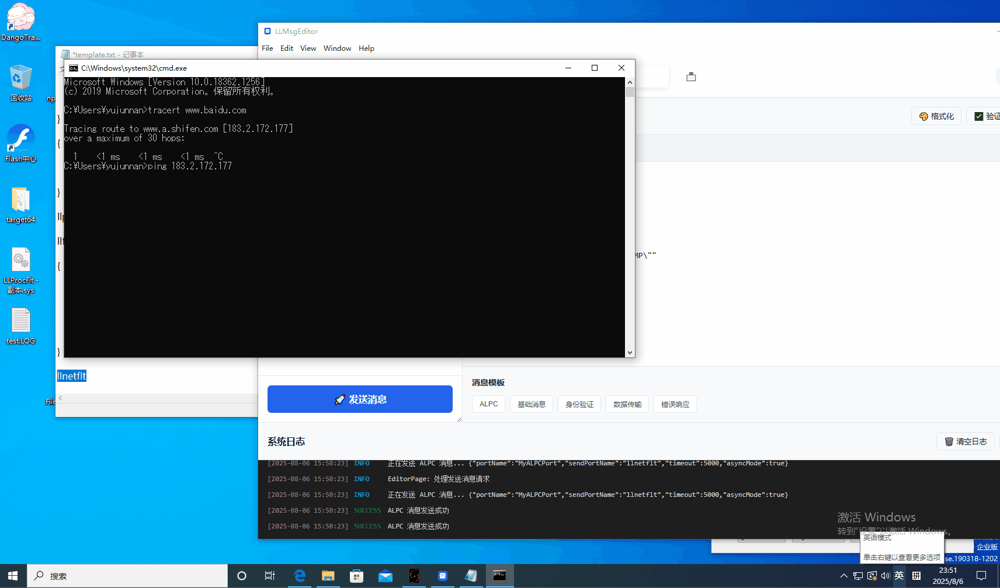

# 面试相关准备材料

## 基于ALPC通信的规则管理框架

基于Electron程序，使用node-addon-api让在js框架中调用C++代码实现的ALPC通信库与驱动通信后，配置相关规则到驱动中，驱动根据规则解析后，保存为一个AST树结构，在每个驱动事件节点，收集事件日志，然后投递到规则引擎中判断，根据规则匹配结果来处理结果。

### 进程过滤

进程启动的管理(阻止通过explorer.exe启动进程的方法)：

进程防护相关的demo演示：

### 文件过滤

针对文件的操作进行过滤，当前只针对文件的访问以及创建进行过滤，因为进程信息保存在进程驱动中，所以如果要过滤文件信息带上进程信息，需要同时安装进程驱动与文件过滤驱动。具体效果为

### 网络过滤

针对网络信息的过滤访问，当前只针对ip，端口，协议等信息进行初步过滤。

其中示例驱动提供了，windows 64位编译的debug版本，路径位于Driver/win10_64目录下，electron界面程序也只提供了64位版本，位于路径MsgSender目录下

### 问题说明

1、文件过滤驱动支持的动作较少，主要是演示作用
2、注册表过滤以及磁盘相关未对接策略故未作演示

